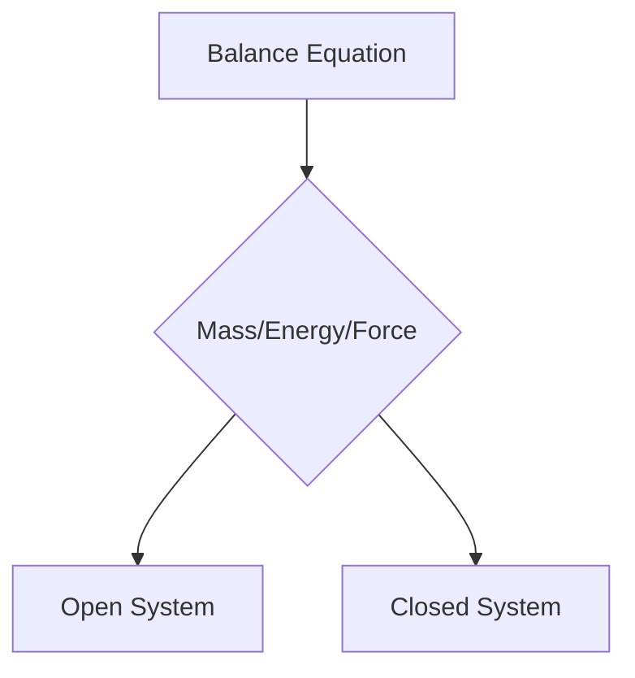
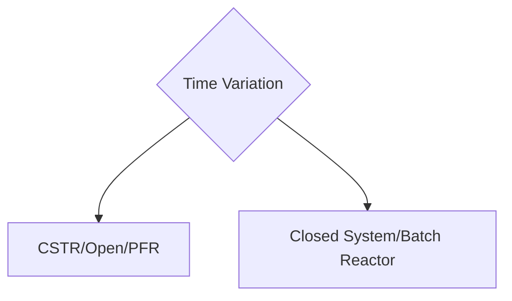

# Modeling of Chemical Engineering Systems

## 1. Reacting Systems
## 2. Systems for Mass Transfers
## 3. Systems for Heat transfers
<br><br>

<strong>Mathematical Modeling:</strong> 
- Mathematical representaion of any model, and data analysis of the model.
- Comprises of data, equation and functions.
- There is response variable, predictor, and parameter


f(x,y,z) = 0 then we can evaluate it as y  = f(x,z)
Can be anything for the model parameter, like Heat transfer


$$Q = K * \frac{ΔT}{ΔX}$$

Now, in such a case, 

$$Q = f(K,ΔT,ΔX)$$

Number of Equations = N
Number of Variables = M

We then analyse what are the number of equations and variables, and then we can solve the system of equations.

## Degree Of Freedom = M - N

If <br>
&nbsp; 1. Number of variables > Number of equations -> Under Specified <br>
&nbsp; 2. Number of variables = Number of equations -> Well Specified <br>
&nbsp; 3. Number of variables < Number of equations -> Over Specified <br>

$$ Question - 1:  DOF Analysis$$


```
Consider the perfectly mixed storage tank shown below. A liquid stream with volumetric rate F1 and densite ρ1 flows into the tank. The outlet stream has volumetric flow rate F0, and densite ρ0. Our objective is to develop a mathematical model for the variation of the tank holdip that is the volume (V) of the fluid in the system. Carry out the degree of freedom analysis for the system.
```

(to be solved later)


# Classification of Model System

## Open System (Continous System)
 Has both mass and heat transfer

## Closed System (batch system)
Has only energy transfer
## Isolated System
No transfer of either mass or energy

In Chemical Engineering we are only concerned with Open Systems.

From the first law of thermodynamics, we know that the energy balance is given by

$$ dU = dQ + dW $$
Where, U is the internal energy, Q is the heat transfer, W is the work done.

So, we only deal with the energy balance equation, and the mass balance equation, and there is practically nothing which is an isolated system.


If there is any variable which is not constant with time -> It means the system is an unsteady state. If there is a change in either of the variables with time, it is an unsteady state.

Example: Fick's Second Law of Diffusion (unsteady state)

$$ \frac{dC}{dt} = D \frac{d^2C}{dx^2} $$

Example: Fick's first law of Diffusion (steady state) 
(this is a simplified form of the above equation, as there is no change with time)

$$ \frac{dC}{dx} = -D \frac{dC}{dx} $$


Example: Newton's Law of Viscosity (this is also steady state fluid flow)

$$ τ = - μ\frac{dV}{dx} $$


` RULE OF THUMB: If there is a change in any variable with time, it is an unsteady state. If there is no change in any variable with time, it is a steady state. `


# Lumped v/s Distributed Model

## Lumped Model

 - There is no change with respect to space in x, y, z
- There will be a set of Ordinary Differential Equations (ODEs) which will be solved to get the solution


`Example: Mass Flow Rate: `
$$ \frac{d(ρV)}{dt} = ρ_fF_f - ρ_iF_i $$

- No spatial variation in temperature, pressure and concentration, only with time

## Distributed Model

- There is a change with respect to space in x, y, z
- Very fucked system of equations, with a lot of variables, and a lot of equations, and partial differential equations (PDEs) are used to solve the system of equations. Solving such systems is very difficult in these cases.
- Both time and spatial variation in flows and states (temperature/pressure and concentration)


` Example: Navier Stokes Equation: `
$$ \frac{\partial ρ}{\partial t} + \frac{\partial (ρV)}{\partial x}  + \frac{\partial (ρV)}{\partial y} + \frac{\partial (ρV)}{\partial z} = 0$$

Steps involved in Modelling and Simulation

- Model Development
- Model Analysis
- Model Optimisation

<br><br>

> Written by Dhruv Dugar on 13/02/2023

# Fundamental Modelling



## Balance Equation

$$ in - out + generation - consumption = accumulation $$

```
# Problem Statement 2
The reaction happens in a contionus stirred tank reactor which can be observed below. Two streams are feeding the reactor. The feed stream has a volumetric feed rate F1 (m^3/s) and concentration CB1, the second stream is a dilute stream with flow rate F2 and concentration CB2. The effulent has flow rate F0 and concentration CB. The reactant is assumed to be in excess thus is not involved in the reaction rate. Carry oyt the mass balance for the CSTR followed by the DOF analysis.
```


## Solution: 

- Component Balance 

$$
\frac{dVC_B}{dt} = F_1C_{B1} + F_2C_{B2} - F_0C_{B0} \\
$$
- Degree of Freedom Analysis
    - Number of Equations = 1
    - Number of Variables = 3 (V, F_0, C_B)
- DOF = 3 - 1 = 2

The System is under specified.
Need to find more equations.


- Overall Mass Balance

$$
\frac{d(Ah)}{dt} = F_1 + F_2 - F_0 \\
$$

- Now number of equations is 2, DOF is still 1

There is a valve in the end, and that means the final flow rate is a function of the height of the holdup in the tank


$$
F_0 = \alpha h \\
$$

Now we have 3 equations, and 3 variables. The degree of freedom is now 0. The system is now well specified.

> Written by Dhruv Dugar on 15/02/2023

# Lumped Models




-> Mass Balance
-> Energy Balance


## Closed System (Batch)

Case 1 (NO REACTION):

- nothing is coming in, nothing is going out

Overall Mass Balance:

$$ in - out + generation - consumption = accumulation $$

There is no input, output, generation, consumption, or even accumulation.

$$ 0 = 0 $$

Case 2 (REACTION):

- Same tank
- No input, no output
- Volume V, Mass m

$$ A -> B $$
$$ -r_A = kC_A $$

Writing the overall mass balance equation

Assuming constant volume:
$$ 0 - 0 - (r_A)(V) = \frac{dC_A}{dt}V $$

$$ -r_AV = \frac{dN_A}{dt} $$


$$ N_A = N_0(1-X_A) \\ \text(where  X_A  is the selectivity)$$

$$ -r_AV = N_A0 \frac{dX_A}{dt} $$


For non constant volume:

$$ 0 - 0 + (r_A)(V) = \frac{dC_A}{dt}V + \frac{dV}{dt}C_A$$


# Open System :- 

Case 1:- CSTR

- Initial Value Problem


$$\text(eq 1) \\ \frac{dV}{dt} = F_f - F_0 $$ 

$$ F_fC_{Af} - F_0C_A - r_AV = d(VC_A)/dt $$

$$ \text(eq 2) \\F_fC_{Af} - F_0C_A - r_AV = \frac{dV}{dt}C_A + \frac{dC_A}{dt}V $$


Solving eq1 and eq2

$$ V \frac{dC_A}{dt} = F_f(C_{Af}- C_A) - r_AV $$


> Written by Dhruv Dugar on 20/02/2023